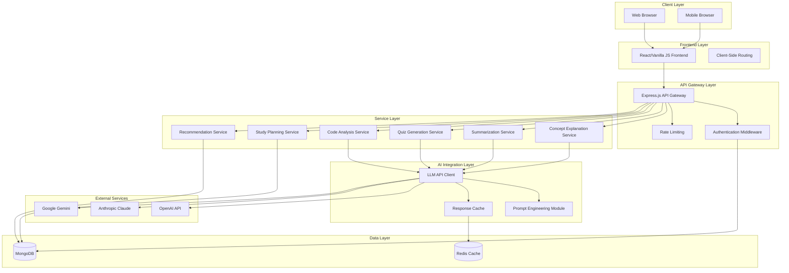
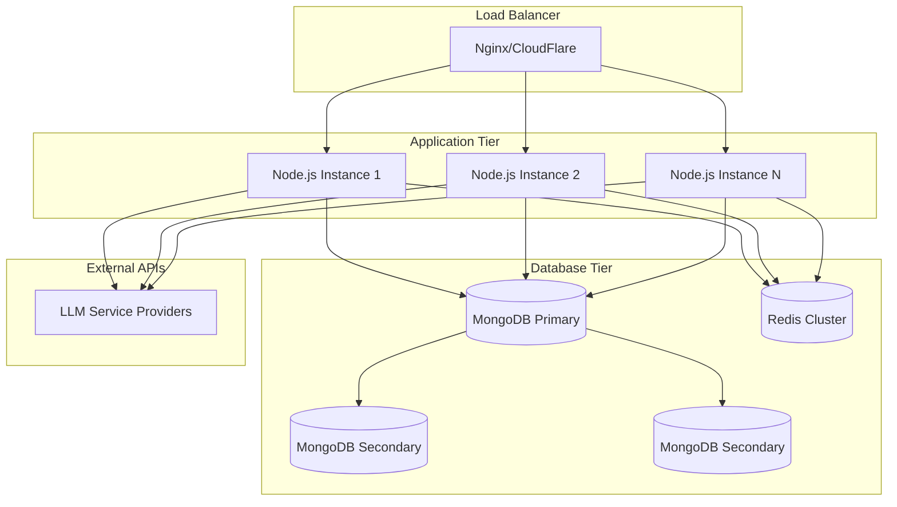

# Design Document

## Overview

The AI Study & Developer Assistant for Students is a web-based educational platform that leverages Large Language Models (LLMs) to provide personalized learning assistance. The system follows a modular, scalable architecture using Node.js backend services, MongoDB for data persistence, and a responsive web frontend. The platform integrates with external LLM APIs to deliver AI-powered features including concept explanation, content summarization, quiz generation, and code analysis.

The design emphasizes simplicity, scalability, and educational effectiveness, targeting college students and beginner programmers who need accessible technical learning support.

## Architecture

### High-Level Architecture



### Deployment Architecture



## Components and Interfaces

### Frontend Components

**Main Application Shell**
- Responsive navigation with feature access
- User authentication state management
- Global loading and error handling
- Mobile-first responsive design

**Concept Explanation Interface**
- Text input for topic/concept queries
- Rich text display for explanations with formatting
- Follow-up question capability
- Bookmark and save functionality

**Notes Summarization Interface**
- Multi-format content input (text, file upload)
- Summary length selection controls
- Hierarchical summary display with collapsible sections
- Export functionality for summaries

**Quiz Generation Interface**
- Content input for quiz source material
- Quiz configuration (type, difficulty, length)
- Interactive quiz taking with immediate feedback
- Progress tracking and score history

**Code Analysis Interface**
- Code editor with syntax highlighting
- Language selection dropdown
- Split-pane view for code and explanations
- Error highlighting and debugging suggestions

**Study Planner Interface**
- Calendar view for study scheduling
- Progress visualization with charts
- Goal setting and deadline management
- Reminder and notification settings

**Recommendation Dashboard**
- Personalized learning suggestions
- Progress analytics and insights
- Achievement tracking and badges
- Learning path visualization

### Backend Services

**Authentication Service**
```javascript
interface AuthService {
  register(userData: UserRegistration): Promise<AuthResult>
  login(credentials: LoginCredentials): Promise<AuthResult>
  validateToken(token: string): Promise<UserSession>
  refreshToken(refreshToken: string): Promise<AuthResult>
  logout(userId: string): Promise<void>
}
```

**Concept Explanation Service**
```javascript
interface ConceptService {
  explainConcept(topic: string, userLevel: string): Promise<Explanation>
  getFollowUpQuestions(conceptId: string): Promise<Question[]>
  saveExplanation(userId: string, explanation: Explanation): Promise<void>
  getUserExplanationHistory(userId: string): Promise<Explanation[]>
}
```

**Summarization Service**
```javascript
interface SummaryService {
  summarizeContent(content: string, options: SummaryOptions): Promise<Summary>
  generateHierarchicalSummary(content: string): Promise<HierarchicalSummary>
  extractKeyPoints(content: string): Promise<KeyPoint[]>
  saveSummary(userId: string, summary: Summary): Promise<void>
}
```

**Quiz Generation Service**
```javascript
interface QuizService {
  generateQuiz(content: string, config: QuizConfig): Promise<Quiz>
  evaluateQuizResponse(quizId: string, responses: Response[]): Promise<QuizResult>
  getQuizHistory(userId: string): Promise<QuizAttempt[]>
  generateFeedback(quizResult: QuizResult): Promise<Feedback>
}
```

**Code Analysis Service**
```javascript
interface CodeService {
  explainCode(code: string, language: string): Promise<CodeExplanation>
  debugCode(code: string, error: string, language: string): Promise<DebugSuggestion>
  identifyPatterns(code: string, language: string): Promise<Pattern[]>
  suggestImprovements(code: string, language: string): Promise<Improvement[]>
}
```

**Study Planning Service**
```javascript
interface StudyPlanService {
  createStudyPlan(userId: string, goals: StudyGoal[]): Promise<StudyPlan>
  updateProgress(userId: string, activity: StudyActivity): Promise<void>
  getProgressAnalytics(userId: string): Promise<ProgressAnalytics>
  generateReminders(userId: string): Promise<Reminder[]>
}
```

**Recommendation Service**
```javascript
interface RecommendationService {
  generateRecommendations(userId: string): Promise<Recommendation[]>
  analyzeWeakAreas(userId: string): Promise<WeakArea[]>
  suggestNextTopics(userId: string, currentTopic: string): Promise<Topic[]>
  updateLearningProfile(userId: string, activity: LearningActivity): Promise<void>
}
```

### AI Integration Layer

**LLM Client Interface**
```javascript
interface LLMClient {
  generateResponse(prompt: string, model: string, options: LLMOptions): Promise<LLMResponse>
  validateResponse(response: LLMResponse): boolean
  handleRateLimit(error: RateLimitError): Promise<void>
  selectOptimalModel(taskType: string): string
}
```

**Prompt Engineering Module**
```javascript
interface PromptEngine {
  buildConceptPrompt(topic: string, userLevel: string): string
  buildSummaryPrompt(content: string, options: SummaryOptions): string
  buildQuizPrompt(content: string, config: QuizConfig): string
  buildCodePrompt(code: string, task: string, language: string): string
  validatePromptLength(prompt: string): boolean
}
```

## Data Models

### User Management

```javascript
// User Schema
{
  _id: ObjectId,
  email: String, // unique, required
  passwordHash: String, // bcrypt hashed
  profile: {
    firstName: String,
    lastName: String,
    learningLevel: String, // beginner, intermediate, advanced
    preferredLanguages: [String], // programming languages
    timezone: String,
    createdAt: Date,
    lastLoginAt: Date
  },
  preferences: {
    summaryLength: String, // brief, detailed, custom
    quizDifficulty: String, // easy, medium, hard
    reminderFrequency: String, // daily, weekly, custom
    darkMode: Boolean,
    emailNotifications: Boolean
  },
  subscription: {
    plan: String, // free, premium
    startDate: Date,
    endDate: Date,
    apiUsage: {
      monthly: Number,
      limit: Number
    }
  }
}
```

### Learning Content

```javascript
// Explanation Schema
{
  _id: ObjectId,
  userId: ObjectId,
  topic: String,
  userLevel: String,
  explanation: {
    content: String,
    examples: [String],
    analogies: [String],
    keyTerms: [{
      term: String,
      definition: String
    }]
  },
  metadata: {
    createdAt: Date,
    model: String, // which LLM was used
    tokens: Number,
    rating: Number, // user feedback
    bookmarked: Boolean
  }
}

// Summary Schema
{
  _id: ObjectId,
  userId: ObjectId,
  originalContent: String,
  summary: {
    brief: String,
    detailed: String,
    keyPoints: [String],
    hierarchical: {
      mainTopics: [{
        title: String,
        subtopics: [String]
      }]
    }
  },
  metadata: {
    createdAt: Date,
    contentLength: Number,
    summaryLength: Number,
    compressionRatio: Number
  }
}

// Quiz Schema
{
  _id: ObjectId,
  userId: ObjectId,
  sourceContent: String,
  config: {
    type: String, // multiple-choice, short-answer, mixed
    difficulty: String,
    questionCount: Number
  },
  questions: [{
    id: String,
    type: String,
    question: String,
    options: [String], // for multiple choice
    correctAnswer: String,
    explanation: String,
    difficulty: String
  }],
  metadata: {
    createdAt: Date,
    estimatedTime: Number
  }
}

// Quiz Attempt Schema
{
  _id: ObjectId,
  userId: ObjectId,
  quizId: ObjectId,
  responses: [{
    questionId: String,
    userAnswer: String,
    isCorrect: Boolean,
    timeSpent: Number
  }],
  result: {
    score: Number,
    percentage: Number,
    totalQuestions: Number,
    correctAnswers: Number,
    timeSpent: Number,
    completedAt: Date
  },
  feedback: {
    strengths: [String],
    weaknesses: [String],
    suggestions: [String]
  }
}
```

### Code Analysis

```javascript
// Code Analysis Schema
{
  _id: ObjectId,
  userId: ObjectId,
  code: String,
  language: String,
  analysisType: String, // explanation, debugging, review
  result: {
    explanation: {
      overview: String,
      lineByLine: [{
        lineNumber: Number,
        code: String,
        explanation: String
      }],
      concepts: [String],
      patterns: [String]
    },
    debugging: {
      errors: [{
        line: Number,
        type: String,
        message: String,
        suggestion: String
      }],
      warnings: [{
        line: Number,
        message: String,
        suggestion: String
      }]
    },
    improvements: [{
      category: String, // performance, readability, best-practices
      suggestion: String,
      example: String
    }]
  },
  metadata: {
    createdAt: Date,
    codeLength: Number,
    complexity: String
  }
}
```

### Study Planning

```javascript
// Study Plan Schema
{
  _id: ObjectId,
  userId: ObjectId,
  title: String,
  goals: [{
    id: String,
    title: String,
    description: String,
    targetDate: Date,
    priority: String, // high, medium, low
    status: String, // not-started, in-progress, completed
    progress: Number // 0-100
  }],
  schedule: [{
    date: Date,
    activities: [{
      type: String, // study, quiz, review, practice
      topic: String,
      duration: Number, // minutes
      completed: Boolean,
      notes: String
    }]
  }],
  analytics: {
    totalStudyTime: Number,
    averageSessionLength: Number,
    completionRate: Number,
    streakDays: Number,
    lastStudyDate: Date
  },
  metadata: {
    createdAt: Date,
    updatedAt: Date
  }
}

// Learning Activity Schema
{
  _id: ObjectId,
  userId: ObjectId,
  type: String, // explanation, summary, quiz, code-analysis
  topic: String,
  duration: Number,
  performance: {
    score: Number, // if applicable
    difficulty: String,
    completion: Boolean
  },
  timestamp: Date,
  metadata: {
    sessionId: String,
    deviceType: String
  }
}
```

### Recommendations

```javascript
// Learning Profile Schema
{
  _id: ObjectId,
  userId: ObjectId,
  strengths: [String],
  weaknesses: [String],
  interests: [String],
  learningStyle: String, // visual, auditory, kinesthetic, mixed
  pace: String, // slow, moderate, fast
  topicMastery: [{
    topic: String,
    level: Number, // 0-100
    lastAssessed: Date
  }],
  recommendations: [{
    type: String, // topic, resource, practice
    title: String,
    description: String,
    priority: Number,
    reason: String,
    createdAt: Date,
    dismissed: Boolean
  }],
  updatedAt: Date
}
```

## Correctness Properties

*A property is a characteristic or behavior that should hold true across all valid executions of a system—essentially, a formal statement about what the system should do. Properties serve as the bridge between human-readable specifications and machine-verifiable correctness guarantees.*

Before defining the correctness properties, I need to analyze the acceptance criteria from the requirements document to determine which ones are testable as properties.

### Property Reflection

After analyzing all acceptance criteria, I identified several areas where properties can be consolidated to eliminate redundancy:

**Content Processing Properties**: Properties 1.1-1.5 (concept explanation), 2.1-2.5 (summarization), and 4.1-4.6 (code analysis) all involve AI content processing with similar quality requirements. These can be consolidated into comprehensive properties that cover the core functionality.

**Quiz Generation Properties**: Properties 3.1-3.6 cover quiz generation and feedback. Properties 3.1 and 3.2 can be combined into a single comprehensive quiz generation property, while 3.5 and 3.6 address distinct functionality.

**User Data Properties**: Properties 7.1-7.6 cover authentication and data management. Properties 7.1-7.3 can be consolidated into a comprehensive security property, while 7.4-7.6 address distinct data operations.

**System Performance Properties**: Properties 8.4, 9.1, and 9.3 all relate to system reliability and can be consolidated into performance and resilience properties.

Based on this analysis, the following properties provide comprehensive coverage without redundancy:

### Correctness Properties

**Property 1: AI Content Generation Quality**
*For any* user input requesting content generation (explanations, summaries, code analysis), the system should produce output that is appropriate for the user's specified level, contains relevant examples or details, and maintains consistent terminology throughout the response.
**Validates: Requirements 1.1, 1.2, 1.4, 1.5, 2.1, 2.2, 4.1, 4.2, 4.6**

**Property 2: Content Structure and Format**
*For any* generated content (summaries, explanations, code analysis), the output should be properly structured with clear formatting, hierarchical organization when appropriate, and beginner-friendly presentation.
**Validates: Requirements 2.3, 2.4, 4.1**

**Property 3: User Configuration Compliance**
*For any* user-specified configuration (summary length, quiz difficulty, question count), the system should generate content that matches the requested parameters.
**Validates: Requirements 2.5, 3.6**

**Property 4: Quiz Generation Completeness**
*For any* content provided for quiz generation, the system should create questions that cover key concepts, include both factual and conceptual question types, and provide plausible distractors for multiple-choice questions.
**Validates: Requirements 3.1, 3.2, 3.3**

**Property 5: Interactive Feedback Provision**
*For any* user interaction requiring follow-up (clarification requests, quiz completion, debugging assistance), the system should provide appropriate additional information, feedback, or explanations.
**Validates: Requirements 1.3, 3.5, 4.3, 4.4**

**Property 6: Multi-Language Code Support**
*For any* supported programming language (Python, JavaScript, Java, C++), the system should provide appropriate code analysis, explanation, and debugging assistance specific to that language's syntax and conventions.
**Validates: Requirements 4.5**

**Property 7: Study Planning Data Integrity**
*For any* study plan operations (creation, progress tracking, schedule updates), all user data should be accurately recorded, properly timestamped, and correctly associated with the user's profile.
**Validates: Requirements 5.1, 5.2**

**Property 8: Progress Visualization Accuracy**
*For any* user progress data, the system should generate visual indicators and analytics that accurately represent completion status, performance trends, and productivity patterns.
**Validates: Requirements 5.3, 5.6**

**Property 9: Adaptive Recommendation Generation**
*For any* user learning profile, the system should generate personalized recommendations that are relevant to identified knowledge gaps, appropriate for the user's learning style and pace, and prioritized based on goals and deadlines.
**Validates: Requirements 6.1, 6.2, 6.3, 6.4, 6.5, 6.6**

**Property 10: Schedule Management and Notifications**
*For any* scheduled study sessions or deadlines, the system should send appropriate reminders at the correct times and suggest plan adjustments when users fall behind schedule.
**Validates: Requirements 5.4, 5.5**

**Property 11: Authentication and Data Security**
*For any* user account operations (registration, login, data storage), the system should implement proper encryption, secure authentication, and data privacy protection.
**Validates: Requirements 7.1, 7.2, 7.3**

**Property 12: Data Access and Isolation**
*For any* user accessing the system, only their personal data should be loaded and accessible, ensuring complete data isolation between users.
**Validates: Requirements 7.4, 7.6**

**Property 13: Data Portability and Deletion**
*For any* user request for data export or account deletion, the system should provide complete data export functionality and ensure thorough data removal upon deletion.
**Validates: Requirements 7.5**

**Property 14: Cross-Device Responsiveness**
*For any* device type (desktop, tablet, mobile), the system interface should function properly and provide appropriate responsive design.
**Validates: Requirements 8.2**

**Property 15: Performance and Response Time**
*For any* user request, the system should respond within the specified time limits (under 5 seconds for most operations) and provide appropriate loading indicators.
**Validates: Requirements 8.4, 8.6**

**Property 16: API Integration Resilience**
*For any* AI service integration, the system should handle rate limits with appropriate retry mechanisms, implement graceful degradation during service outages, and maintain cached responses when possible.
**Validates: Requirements 9.1, 9.3**

**Property 17: Input Validation and Content Safety**
*For any* user input, the system should validate and sanitize data before processing, implement content filtering for appropriate educational content, and provide user-friendly error messages without exposing technical details.
**Validates: Requirements 9.2, 9.4, 9.6**

**Property 18: System Monitoring and Logging**
*For any* AI interaction or system operation, appropriate logs should be created for quality monitoring and improvement purposes while maintaining user privacy.
**Validates: Requirements 9.5**

## Error Handling

### Client-Side Error Handling

**Network Connectivity Issues**
- Implement retry mechanisms with exponential backoff
- Cache recent responses for offline access to summaries and explanations
- Display clear connectivity status indicators
- Queue user actions when offline and sync when connection is restored

**Input Validation Errors**
- Provide real-time validation feedback for form inputs
- Display specific error messages for invalid content formats
- Implement client-side length limits for text inputs
- Guide users toward correct input formats with examples

**UI State Management Errors**
- Implement error boundaries to catch React component errors
- Provide fallback UI components when errors occur
- Clear error states when users navigate to different sections
- Log client-side errors for debugging without exposing sensitive data

### Server-Side Error Handling

**AI Service Integration Errors**
- Implement circuit breaker pattern for AI API calls
- Provide fallback responses from cache when AI services fail
- Handle rate limiting with intelligent request queuing
- Implement timeout handling for long-running AI requests
- Log AI service errors with request context for debugging

**Database Operation Errors**
- Implement transaction rollback for failed multi-step operations
- Provide data consistency checks before and after operations
- Handle connection pool exhaustion gracefully
- Implement read replica fallback for read operations
- Log database errors with query context (sanitized)

**Authentication and Authorization Errors**
- Implement secure session management with automatic cleanup
- Handle token expiration with automatic refresh
- Provide clear error messages for authentication failures
- Implement account lockout protection against brute force attacks
- Log security events for monitoring and alerting

**Resource Management Errors**
- Implement memory usage monitoring and cleanup
- Handle file upload size limits and format validation
- Manage concurrent user sessions and resource allocation
- Implement graceful degradation under high load
- Monitor and alert on resource usage thresholds

### Error Recovery Strategies

**Automatic Recovery**
- Retry failed operations with exponential backoff
- Automatically refresh expired authentication tokens
- Recover from temporary database connection issues
- Resume interrupted file uploads and long-running operations

**User-Guided Recovery**
- Provide clear instructions for resolving common errors
- Offer alternative approaches when primary methods fail
- Allow users to retry failed operations manually
- Provide contact information for unresolvable issues

**Data Integrity Protection**
- Implement data validation at multiple layers
- Use database constraints to prevent invalid data states
- Implement backup and restore procedures for critical data
- Provide data export functionality before destructive operations

## Testing Strategy

### Dual Testing Approach

The system will implement both unit testing and property-based testing to ensure comprehensive coverage and correctness validation.

**Unit Testing Focus**:
- Specific examples and edge cases for each component
- Integration points between frontend and backend services
- Error conditions and boundary cases
- Authentication and authorization workflows
- Database operations and data model validation

**Property-Based Testing Focus**:
- Universal properties that hold across all valid inputs
- AI content generation quality and consistency
- User data integrity and security properties
- System performance and reliability characteristics
- Cross-device compatibility and responsive design

### Property-Based Testing Configuration

**Testing Framework**: Use `fast-check` for JavaScript/Node.js property-based testing
**Test Iterations**: Minimum 100 iterations per property test to ensure comprehensive input coverage
**Test Tagging**: Each property test must reference its corresponding design document property

**Example Property Test Structure**:
```javascript
// Feature: ai-study-developer-assistant, Property 1: AI Content Generation Quality
describe('AI Content Generation Quality', () => {
  it('should generate appropriate content for user level', 
    fc.property(
      fc.record({
        topic: fc.string({ minLength: 5, maxLength: 100 }),
        userLevel: fc.constantFrom('beginner', 'intermediate', 'advanced'),
        contentType: fc.constantFrom('explanation', 'summary', 'code-analysis')
      }),
      async (input) => {
        const result = await contentService.generateContent(input);
        
        // Verify content is appropriate for user level
        expect(result.content).toBeDefined();
        expect(result.userLevel).toBe(input.userLevel);
        expect(result.examples).toHaveLength.greaterThan(0);
        
        // Verify terminology consistency
        const terminology = extractTerminology(result.content);
        expect(terminology).toBeConsistent();
      }
    )
  );
});
```

### Unit Testing Strategy

**Component Testing**:
- Test individual React components with various props and states
- Verify component rendering and user interaction handling
- Test form validation and submission workflows
- Validate responsive design breakpoints

**Service Layer Testing**:
- Test each backend service with specific input examples
- Verify error handling for invalid inputs and edge cases
- Test database operations with known data sets
- Validate API endpoint responses and status codes

**Integration Testing**:
- Test complete user workflows from frontend to backend
- Verify authentication and session management
- Test file upload and processing workflows
- Validate AI service integration with mock responses

**Security Testing**:
- Test authentication and authorization mechanisms
- Verify input sanitization and validation
- Test data encryption and secure storage
- Validate session management and logout procedures

### Performance Testing

**Load Testing**:
- Test system performance under concurrent user load
- Verify response times meet specified requirements (< 5 seconds)
- Test AI API rate limiting and retry mechanisms
- Validate database performance under high query volume

**Stress Testing**:
- Test system behavior at maximum capacity
- Verify graceful degradation under resource constraints
- Test memory usage and garbage collection efficiency
- Validate error handling under extreme conditions

### Continuous Testing Integration

**Automated Test Execution**:
- Run unit tests on every code commit
- Execute property-based tests in CI/CD pipeline
- Perform integration tests before deployment
- Run security scans and vulnerability assessments

**Test Coverage Requirements**:
- Minimum 80% code coverage for unit tests
- 100% coverage of critical security and data integrity paths
- Property test coverage for all defined correctness properties
- Integration test coverage for all user-facing workflows

**Quality Gates**:
- All tests must pass before code merge
- Performance tests must meet response time requirements
- Security tests must pass vulnerability scans
- Property tests must complete successfully with no failures